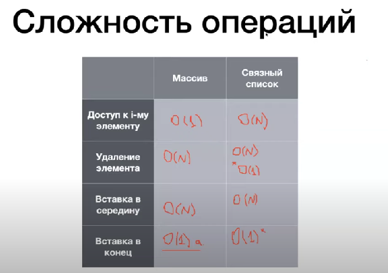

# Базовые структуры данных

Нужно думать какую структуру данных выбираешь

## Массив
Массив - непрерывный участок в памяти компьютера.

Доступна арифметика адресов, потому что зная где нулевой элемент, можем знать адрес 10-го, например. Как следствие, получаем быстрый доступ по индексу.
Минус - медленные вставка и удаление.

Но вставка в конец, то есть append к массиву производится за линейное время, а не линейное

Метод для определения размера инстанса:
``` Python
from sys import getsizeof
a = []
getsizeof(a)
```

При автоматическом расширении массива он изначально увеличивается в 2 раза, но при большом количестве инстансов в массиве кратность увеличения стремится к 1.25


# Амортизированная стоимость
Если есть тяжелая операция, которая выполняется достаточно редко.

Сложность тяжелой операции как бы размазывается, поскольку происходит достаточно редко, она учитывается но со звездочкой)

# Связный список
Каждый элемент указывает на следующий элемент. Из плюсов - не нужно выделять непрерывный участок память. Получение по индексу - линейная операция. Также он требует больше памятия, поскольку приходится хранить много указателей. Удаление с конца и добавление в конец, увы линейны, но удаление в начале и добавление в начале - за константу

https://visualgo.net/en - интересный сайт с визуализацией алгоритмов.

Есть ещё double linked list, который отличается тем, что у каждого элемента по две ссылки. У первого элемента head есть связь с tail, поэтому у всех элементов без исключения два указателя на соседние элементы

### Задача на поиск цикла в связном списке:
С доп памятью:
- Просто идти и расставлять флаги. Наткнулись на поднятый - есть цикл
- Можно хранить в сете номера прошедших элементов

Без доп памяти:
- Ходим двумя указателями с разными видами шагов: один указатель ходит просто к следующему, а другой прыгает через одну ноду. Если они когда-нибудь пересекутся не дойдя до конца списка, то есть цикл

Ещё раз повторим сложности:



# Абстрактный тип данных
Это некоторая сущность, обладающая заданным набором свойств (лучше сказать методов, наверное). Например, целые числа, а их свойства - арифметические операции и операции сравнения

Для чисел в Python есть длинная арифметика. Очень большие числа хранятся массивами. Операции с большими числами проделываются дольше, увы...

## Стек (LILO)
Это абстрактный тип данных, обладающий следующими функциями:
 - push - добавить элемент на вершину стека
 - peek - получить значение элемента на вершине стека
 - pop - удалить элемент с вершины стека

Для реализации стека лучше использовать массив

## Очередь (FILO)
Это также абстрактный тип данных, обладающий следующими функциями:
 - enqueue - добавить элемент в конец очереди
 - dequeue - удалить значение из начала очереди
 - peek - "подсмотреть" элемент в начале очереди

При реализации массивом (можем перевернуть массив) одна из двух первых операций будет линейной, поэтому тут предпочтительнее двусвязный список. 

Но! Можно реализовать очередь на двух стеках: один стек на запись, а второй на удаление. Подробное описание: https://habr.com/ru/articles/483944/


