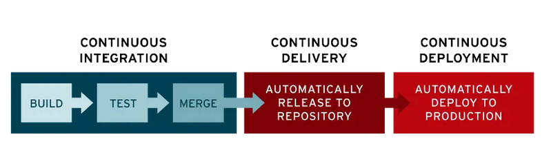

# Вводная лекция (Workshop)

## CI/CD

## Least Privilage Principle
Принцип, по которому разработчику/пользователю выдают минимально необходимые привилегии доступа для решения его задач.

-- Остановился на 49-й минуте

## Интересные факты
'~' - в названии директорий называется на жаргоне хомяком (home)
